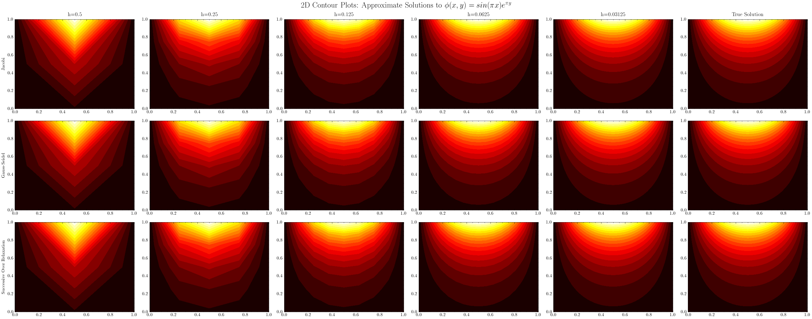
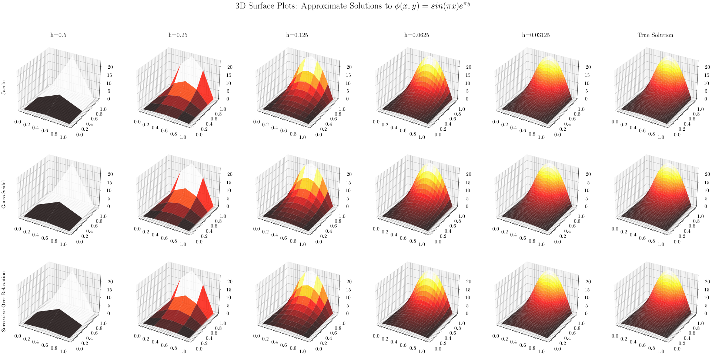

# Partial Differential Equations Overview

## Repository Overview
This repository offers a comprehensive introduction to solving Partial Differential Equations (PDEs) using iterative methods. Our goal is to elucidate the efficiency, accuracy, and convergence characteristics of three prominent iterative techniques: Jacobi, Gauss-Seidel, and Successive Over Relaxation (SOR).

## Equation & PDE Overview

The focus is on a two-dimensional Laplace equation with Dirichlet boundary conditions. We aim to approximate solutions using finite difference schemes and iterative methods.

$$
\Phi(x, y, t) = \nabla^2 \Phi(x, y, t)
$$

The process involves:
1. Discretizing the Laplace equation via finite difference schemes.
2. Employing iterative methods such as Jacobi, Gauss-Seidel, and SOR.
3. Analyzing the results to assess the impact of grid spacing (h) on speed and accuracy and comparing the convergence rates of the iterative methods.

Here, $\Phi(x, y, t)$ denotes temperature at a given point $(x, y)$ and time $t$, with $\nabla^2$ representing the Laplacian operator. This equation is fundamental in modeling heat diffusion in various scientific and engineering contexts.

## Concepts and Theories

### Partial Differential Equation and Parameters:
Consider a square metal plate with temperature $\Phi(x, y)$, satisfying the equation $\Phi_{xx} + \Phi_{yy} = 0$. The plate's bottom and left edges form the x-axis ($0 \leq x \leq 1$) and y-axis ($0 \leq y \leq 1$), respectively.

### Boundary Conditions
As a 2D boundary value problem, four boundary conditions are necessary for a unique solution. The top edge temperature is $\Phi(x, 1) = \pi e \sin(\pi x)$, while the bottom, left, and right edges are defined as $\Phi(x, 0) = \sin(\pi x), \Phi(0, y) = \Phi(1, y) = 0$.

### Computing Analytical Solution:
This is a 2D boundary value problem that can be solved using the eigenfunction expansion
method; however, this method can be extremely difficult. Instead we will invoke an analytical
approach.
In order to find an analytical solution, we must discretize the partial differential equation and
use iterative methods.

## Iterative Methods

### Jacobi Method
In the Jacobi method, the temperature at each grid point is updated based on its neighbors' values, iterating until convergence is achieved.

$$
w_{ij}^{(k+1)} = \frac{1}{4}(w_{(i+1),j}^{(k)} + w_{(i-1),j}^{(k)} + w_{i,(j+1)}^{(k)} + w_{i,(j-1)}^{(k)}) + \frac{h^2}{4}f_{ij}
$$

### Gauss-Seidel Method
The Gauss-Seidel method updates temperatures in-place for faster convergence compared to Jacobi.

$$
w_{ij}^{(k+1)} = \frac{1}{4}(w_{(i+1),j}^{(k+1)} + w_{(i-1),j}^{(k+1)} + w_{i,(j+1)}^{(k+1)} + w_{i,(j-1)}^{(k+1)}) + \frac{h^2}{4}f_{ij}
$$

### SOR Method
SOR enhances Gauss-Seidel by incorporating a relaxation factor ($\omega$) for potentially faster convergence.

$$
w_{ij}^{(k+1)} = (1 - \omega)w_{ij}^{(k)} + \frac{\omega}{4}(w_{(i+1),j}^{(k+1)} + w_{(i-1),j}^{(k+1)} + w_{i,(j+1)}^{(k+1)} + w_{i,(j-1)}^{(k+1)}) + \frac{h^2}{4}f_{ij}
$$

## Results
The linear system is solved for $h = \frac{1}{2}, \frac{1}{4}, \frac{1}{8}, \frac{1}{16}, \frac{1}{32}, \frac{1}{64}$. Reduced h leads to smoother plots, indicating lower approximation error. The convergence visualization demonstrates the efficiency of SOR, followed by Gauss-Seidel and Jacobi. The relationship between h and convergence rate ($\rho(B)$) for each method is also examined.

### Convergence Behavior
As expected, SOR converges the fastest, followed by Gauss-Seidel then Jacobian.

This observation can also be explained mathematically by evaluating $\rho(B)$ for each method.

- $\rho(B_J) = \cos(\pi h) \approx 1 - \frac{2\pi}{h}$
- $\rho(B_{GS}) = \cos^2(\pi h) \approx 1 - \pi^2h^2$
- $\rho(B_{w^*}) = \frac{\pi h}{2(1 + \sqrt{1 - \rho(B_J)^2})} - 1 \approx 1 - 2$

Notice that $\rho(B) \to 1$ as $h \to 0$. Thus, as $h$ decreases, the asymptotic rate of convergence will approach 1. If the asymptotic rate of convergence is approximately one, this means we are converging very slowly. To summarize, we can conclude that using a large $h$ will increase speed and decrease accuracy. Conversely, using a small $h$ will reduce speed and improve accuracy.

## Conclusion

This project highlights the effectiveness of iterative methods in solving PDEs. It emphasizes the need for selecting suitable numerical approaches for precise and efficient problem-solving in various scientific and engineering applications.
